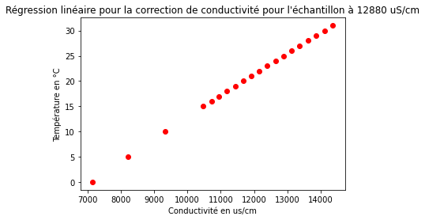
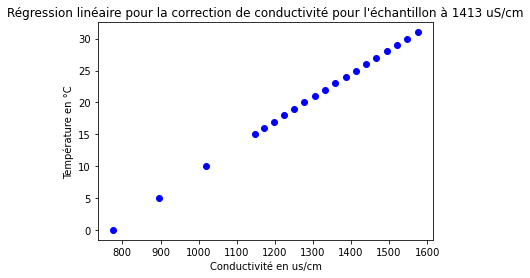
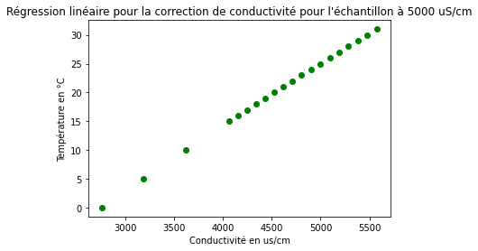

Etalonnage
==========

Un nouveau calibrage est conseillé à chaque nouvelle utilisation du conductimètre. 
Cependant, le programme enregistre à chaque fois le dernier étalonnage en date et le réutilise si 
vous n’en refaites pas.
 
Protocole
--------- 

1. Entrez le nombre d’étalon que vous voulez mesurer, il est conseillé d’en faire au moins 3. 

2. Indiquez la conductivité de votre premier étalon.

**Remarque** : Si cette mesure correspond à 12,8 mS/cm, 1413 μS/cm ou 5000 μS/cm, les 
conductivités seront corrigées selon la température de la solution. Il vous faudra alors 
plonger le thermomètre dans la solution.

3. Versez votre étalon dans un bécher de 50mL.

4. Plongez le conductimètre et le thermomètre dans la solution en les immergeant bien 
comme sur le schéma suivant : 

.. figure:: images/schema_electrodes.png 

   :width: 800
   
5. Appuyez sur Entrée pour lancer la mesure.
Cette étape peut prendre du temps.
 
6. L’écart type ainsi qu’un graphique vous sont affichés, il vous faut indiquer à l’ordinateur si la 
mesure est assez stable. 
Si la mesure n’est pas stable, elle sera effectuée une nouvelle fois.

7. Une fois que vous avez indiqué la série de mesure comme stable, vous pouvez passer à la 
solution étalon suivante en répétant les étapes 2 à 6.

8. Une fois tous vos étalons faits, la courbe d’étalonnage devrait s’afficher sur votre ordinateur. 

Ce calibrage est ainsi enregistré dans votre ordinateur sous le nom **dernier_étalonnage.csv’**
en écrasant le dernier fichier du même nom. 
*Remarque : Si vous voulez le conserver même si vous 
refaite un étalonnage, il vous suffit de le renommer.*
Une fois toutes ces étapes effectuées, vous avez fini le calibrage. Vous pouvez passer aux mesures. 
 
Principe général du code python 
-------------------------------

Le conductimètre que nous avons construit mesure une tension en bits convertie simplement en volt. Or il existe une relation linéaire entre cette tension et la conductivité d'une solution. L'étalonnage nous permet de réaliser une régression linéaire  à partir d'échatillons dont la conductivité est connue, nous permettant par la suite de déterminer la conductivité de n'importe quel échantillon. 

La conductivité varie de façon linéaire en fonction de la température. En revanche cette relation dépend de la conductivité initiale de notre échantillon. Le code python que nous avons développé intègre des corrections de température uniquement pour des solutions étalons de 12 880 us/cm, 1413us/cm et 5000 us/cm. Cela est problématique pour deux raisons. D'une part les solutions étalons mis à disposition des utilisateurs n'ont pas nécessairement ces valeurs de conductivité; D'autre part effectuer une correction de température uniquement pendant l'étalonnage suppose que la température  de la solution reste constante pendant toute la durée de la manipulation. 

   :width: 600
  

   :width: 600
  

   :width: 600
  
 

 
