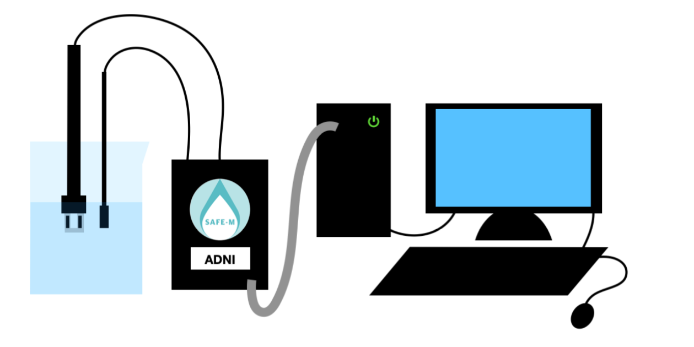
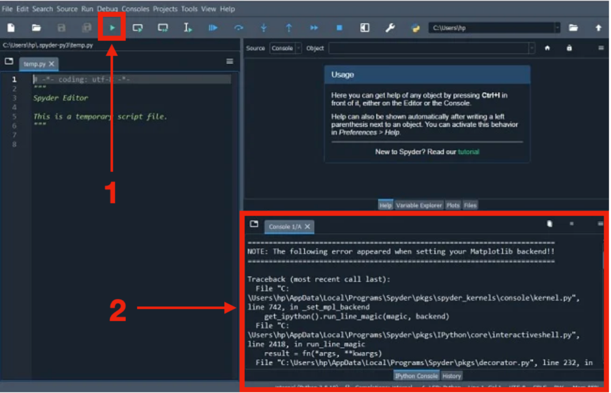

Installation
============

Pour commencer à utiliser le conductimètre, 
branchez-le à votre ordinateur à l’aide d’un câble 
arduino. 

   :width: 750
   
Dans le logiciel Spyder sur l’ordinateur, lancez le 
fichier ‘ADNI_ProgrammePython.py’. Ensuite, appuyez 
sur le logo ▶︎ (indiqué par un **1** dans le schéma ci- dessous)  en haut à gauche, le programme devrait ensuite se lancer dans 
la console (indiqué par un **2** dans le schéma ci- dessous).

   :width: 750
   

Il vous suffit ensuite de suivre les instructions dictées par le programme en rentrant vos choix 
directement à la suite du programme puis en appuyant sur Entrée. 
Le mode d’emploi pour l’étalonnage et les mesures se trouve
dans la suite de ce manuel. 
Le nombre de valeurs prises en compte lors des calculs de 
conductivité moyenne (par étalon ou par mesure) est défini par défaut, mais vous pouvez les modifier au début en 
entrant ‘3’ dans l’interface d’accueil. Attention, les valeurs modifiées ne s’enregistrent pas si vous 
relancez le programme.
